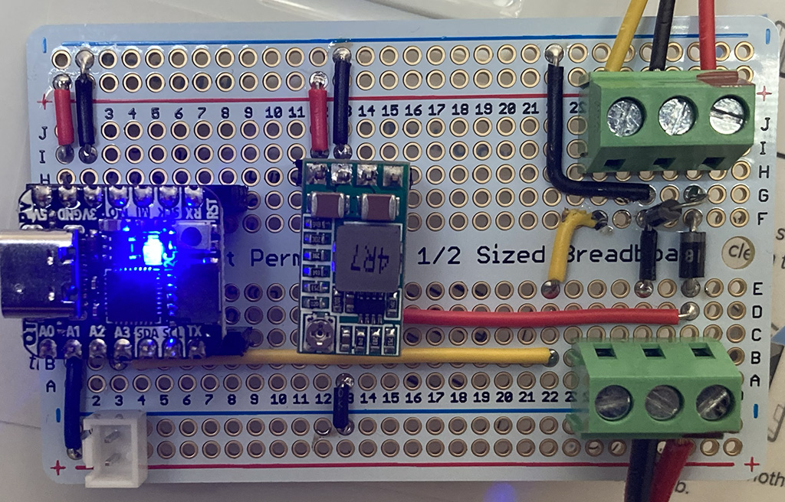

# Adafruit QT Py-based replacement fan controller for a defunct Levoit 131P air filter

After a _second_ Levoit 131P "Smart True HEPA Air Purifier" died after a power fluctuation, I decided to make it less "smart" with an [Adafruit QT Py](https://www.adafruit.com/product/4600) to control the PWM signal to the fan motor.

## Quickstart

This is the breadboard I assembled to host the QT Py and control the fan. It's got a Schottky diode to protect the circuit from the motor backfeeding energy into the "clean" side of the circuit. It's also got a buck converter to bring the 24V input down to 5V for the QT Py.

The code expects to use pin A0 for a momentary switch to select one a fan speed, and pin A2 for PWM signal to the fan motor.

1. Load CircuitPython 9.x on to the QT Py
2. Copy [`code.py`](code.py) and the [`lib`](lib) folder to the QT Py

## Code of Conduct

We are committed to fostering an open and welcoming environment. Please read our [code of conduct](CODE_OF_CONDUCT.md) before participating in or contributing to this project.

## Contributing

We welcome contributions and collaboration on this project. Please read our [contributor's guide](CONTRIBUTING.md) to understand how best to work with us.

## License and Authors

[ Daniel James](https://thzinc.com)

This software is made available by Daniel James under the MIT license.
